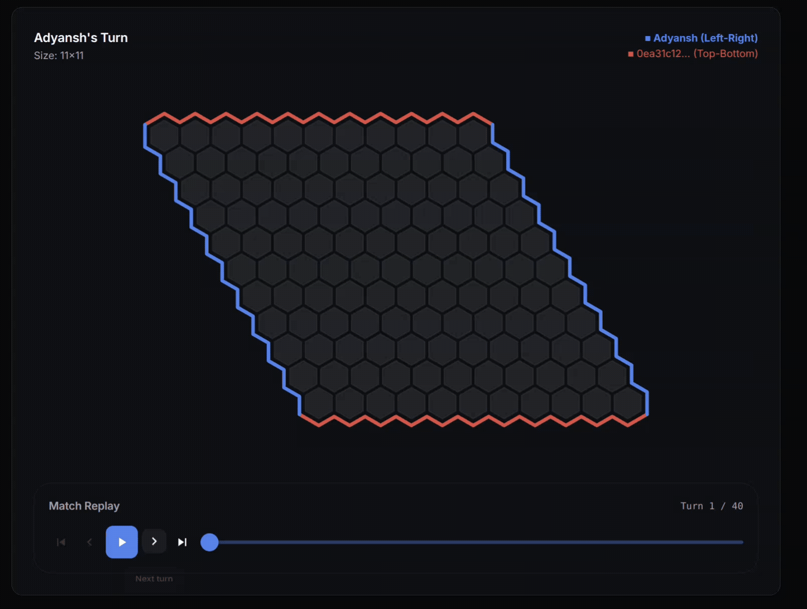

# Hex Game AI — Hackathon Agents

AI agents for the game of **Hex** (11×11), built for a **Game AI hackathon** on the
AICA Game AI Platform. The files are numbered to show how the agents evolved — from a
naive heuristic, through the alpha-beta searcher I submitted and **won the final
with** (`v6_hackathon_agent.py`), to a post-hackathon rewrite of its evaluation
(`v7_resistance_agent.py`) that now **beats my hackathon agent as both colours**.



*Above: the final round of the hackathon, which my agent won.*

---

## The game (Hex, in short)

Hex is a two-player connection game on an 11×11 rhombus of hexagons.

- Players alternate placing one stone of their colour on any empty cell.
- **Player 0 connects Left ↔ Right; Player 1 connects Top ↔ Bottom.**
- The first player to form an unbroken chain of their stones between their two sides
  **wins**.
- There are **no draws** — when the board fills, exactly one player has connected.
- **No swap rule** is used, so the first player (Player 0) has a real advantage.
- On the platform each move must return within **5 seconds**, and only the Python
  standard library + `numpy` are allowed.

## The hackathon

Each entrant writes an `agent.py` (subclassing `gamelib.hex.agent.Agent`, implementing
`initialize()` and `get_move()`). Agents play each other on the platform, ending in a
tournament. I iterated through the designs below and submitted
**`v6_hackathon_agent.py`**, an iterative-deepening alpha-beta searcher — which won.

Afterwards I revisited the **evaluation function** (how a position is scored) and
replaced its shortest-path heuristic with an **electrical-resistance model** (the
classic *Hexy/Wolve* idea). That agent, **`v7_resistance_agent.py`**, is now the
strongest here: it beats `v6_hackathon_agent.py` ~80% of the time, evenly across both
colours.

---

## Repo layout

| File | Role |
|---|---|
| `v1_heuristic_agent.py` | Baseline: centre preference + play next to own stones. No search. |
| `v2_alphabeta_agent.py` | First real search: iterative-deepening **alpha-beta** + Dijkstra distance eval. |
| `v3_bridges_agent.py` | + **bridge** patterns, a two-ply threat guard, and an opening book. |
| `v4_transposition_agent.py` | + 1-D board, **Zobrist hashing + transposition table**, bridge-aware distances. |
| `v5_pvs_bitboard_agent.py` | + **bitboard** win detection, **principal-variation search**, **killer moves**. |
| `v6_hackathon_agent.py` | **The agent I submitted and won with** — all of the above + a two-ply fork guard + dynamic time management. |
| `v7_resistance_agent.py` | **Champion** — `6`'s search with the evaluation replaced by an **electrical-resistance** model. Beats `6`. |
| `mcts_experiment_agent.py` | A Monte-Carlo Tree Search experiment (see *Design choices*). Not part of the linear progression. |
| `arena.py` | Head-to-head benchmarking harness used for all numbers below. |
| `resistance_agent_deepdive.md` | **Full technical explanation of `v7_resistance_agent.py`** — algorithms, math, diagrams. |
| `visualizer/` | **Interactive visualizer** — records a real game and shows the agent's resistance networks, alpha-beta tree, paths and ranking as a standalone HTML page. See [`visualizer/README.md`](visualizer/README.md). |
| `final_match.gif` | The winning final round. |

> The file uploaded during the event was `v6_hackathon_agent.py` with comments
> stripped and debug output off — so `v6_hackathon_agent.py` is the readable version
> of the winning agent.
>
> Numbering reflects **increasing capability** (each step adds a concrete feature over
> the last); it matches the order the mature agents were built in. The MCTS agent was
> a side branch and is left unnumbered.

---

## How each version improved

- **1 → 2:** from a static heuristic to actual lookahead. `2` runs iterative-deepening
  alpha-beta over a Dijkstra estimate of each player's connection distance, with
  immediate win/block detection.
- **2 → 3:** Hex-specific knowledge. `3` adds **bridges** (a two-cell virtual
  connection), a **two-ply threat guard** so it never walks into an immediate loss,
  and an opening book.
- **3 → 4:** speed, so it can search deeper. `4` flattens the board to 1-D, adds
  **Zobrist hashing + a transposition table** (so repeated positions aren't
  re-searched), and treats bridges as cheap virtual links in the distance.
- **4 → 5:** stronger search. `5` adds **bitboard flood-fill** win detection,
  **principal-variation search** (null-window re-search), and **killer-move** ordering
  for deeper pruning.
- **5 → 6:** hardening for competition. `6` adds a **two-ply fork/danger guard** and
  **soft/hard dynamic time management**. This is the hackathon winner.
- **6 → 7:** a better *evaluation*. `7` keeps `6`'s entire search but replaces the
  shortest-path score with an **electrical-resistance** score (details below and in
  [`resistance_agent_deepdive.md`](resistance_agent_deepdive.md)). This is the single
  change that makes it beat `6`.

---

## The champion: `v7_resistance_agent.py`

It keeps the proven `6` machinery — iterative-deepening PVS alpha-beta, Zobrist
transposition table, killer moves, bitboard win detection, opening book, and a
tactical safety layer (immediate win, immediate block, two-ply fork guard) — and
changes **how a position is scored**:

- **Electrical-resistance evaluation.** The board is a resistor network: your stones
  conduct strongly, empty cells weakly, the opponent's stones block. The score is
  `log(R_opponent / R_me)` between each player's two edges, solved with `numpy`.
  Unlike a single shortest path, this rewards positions with **many** connecting paths
  and their overlaps — exactly what wins races in Hex, and why it out-positions `6`'s
  Dijkstra evaluation.
- **Bridge / virtual-connection augmentation** in the resistor graph, plus a
  **save-bridge reply** when the opponent intrudes into a bridge.
- **A single-thread BLAS trick** — `numpy`'s BLAS is forced to one thread *before*
  `numpy` is imported, dropping a 121×121 solve from ~9 ms to ~0.1 ms, cheap enough to
  evaluate at every search leaf inside 5 s.

The biggest tuning knob was how strongly your own stones conduct: raising it (with the
bridge strength scaled to match) lifted the win rate against `6` from ~65% to ~80%.
Full derivation, math, and diagrams: **[`resistance_agent_deepdive.md`](resistance_agent_deepdive.md)**.

---

## Benchmarks

From `arena.py` (included): two agents play many **random openings**, each opening
once with each agent as Player 0, at the full ~4.5 s/move budget.
`v7_resistance_agent.py` vs the others:

| Opponent | Result | Notes |
|---|---|---|
| **`v6_hackathon_agent.py`** | **80%** (80 / 100 games) | **P0 80%, P1 80%** — balanced; also wins the natural no-opening game as *both* colours |
| `v5_pvs_bitboard_agent.py` | 100% (16 / 16) | |
| `v4_transposition_agent.py` | 81% (13 / 16) | |
| `mcts_experiment_agent.py` | 100% (16 / 16) | |

*(It also beat a dropped post-`6` variant 90%, not included here.)*

Reading the numbers:

- The headline figure is over 100 games (±~8% at 95% confidence). Smaller batches swing
  more (I saw 63–92%) because both agents use *wall-clock* iterative deepening, so
  search depth — and the move in knife-edge positions — shifts slightly with CPU load.
  100 games gives the reliable central estimate: **~80%, symmetric across colours.**
- **100% is impossible** in no-swap Hex: the first player has a theoretical win, so some
  random openings are lost for whoever moves second regardless of skill. ~80% *balanced
  across both colours* is close to the practical ceiling for a hand-crafted agent, and
  `v7_resistance_agent` is decisively stronger than every earlier version.

---

## Design choices

**Why alpha-beta search instead of MCTS.** MCTS (as in the world-class engine MoHex)
is excellent for Hex, but its strength needs *tens of thousands* of simulations per
move — which requires C/C++ or a GPU. In **pure Python** you get only a few thousand
random playouts per second, and the platform bans everything outside the standard
library and `numpy` (no `numba`, `cython`, PyTorch). I built an MCTS agent
(`mcts_experiment_agent.py`) and it was weaker. Meanwhile the historically dominant
*alpha-beta* Hex engines (Hexy, Six, Wolve) reached championship level with only a
**2–4 ply search plus a strong evaluation** — the right fit for these constraints.

**Why an electrical-resistance evaluation instead of shortest path.** A shortest-path
score sees one route to victory; resistance sees *all* of them and how they reinforce
each other. This is why `7` beats `6`, and it mirrors what the strongest classical
engines used.

**Other engineering.** Bitboard flood-fill for fast win checks, Zobrist hashing + a
transposition table so repeated positions aren't re-searched, PVS + killer-move
ordering for deeper pruning, an opening book, and a two-ply fork guard so the search
never walks into an immediate loss. Move budgets stay conservatively under 5 s (≈4.4 s
max observed) so a slow tournament machine can't cause a timeout loss.

---

## Running the agents

Requires **Python 3.12** (the agents use `typing.override`) with `aica-gamelib` and
`numpy`:

```bash
pip install aica-gamelib numpy
```

Play against the champion yourself (enter moves as `row,col`):

```bash
gamelib-play hex v7_resistance_agent.py human
```

Watch two agents play (use relative paths):

```bash
gamelib-play hex v7_resistance_agent.py v6_hackathon_agent.py
```

Reproduce the benchmarks with the included arena (colour-balanced, parallel):

```bash
python arena.py v7_resistance_agent.py v6_hackathon_agent.py --games 50 --openings 2 --time 4.5 --jobs 8
```

`--time` sets each agent's per-move budget, `--openings N` plays N random opening plies
before the agents take over (0 = the agents' own openings), and `--jobs` controls
parallelism. Use the full ~4.5 s for representative results.

---

*`v6_hackathon_agent.py` is the agent I submitted and won the hackathon with;
`v7_resistance_agent.py` is the stronger post-hackathon evaluation that now beats it —
explained in depth in [`resistance_agent_deepdive.md`](resistance_agent_deepdive.md).*
