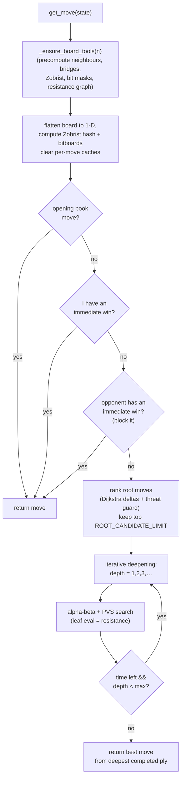
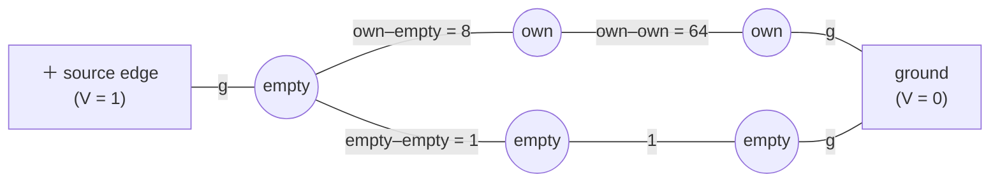
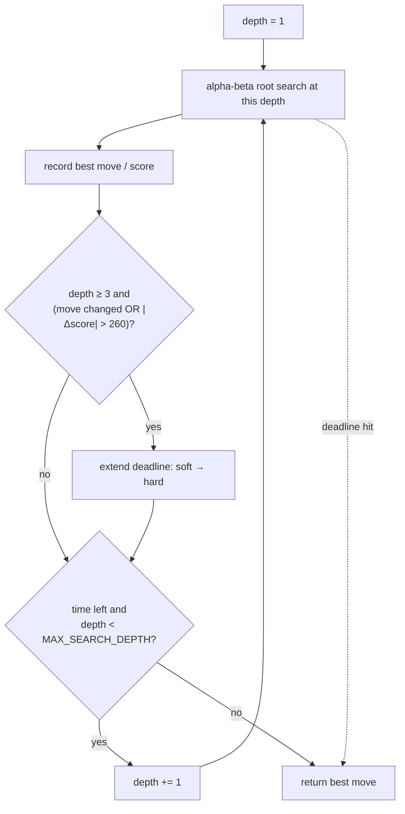
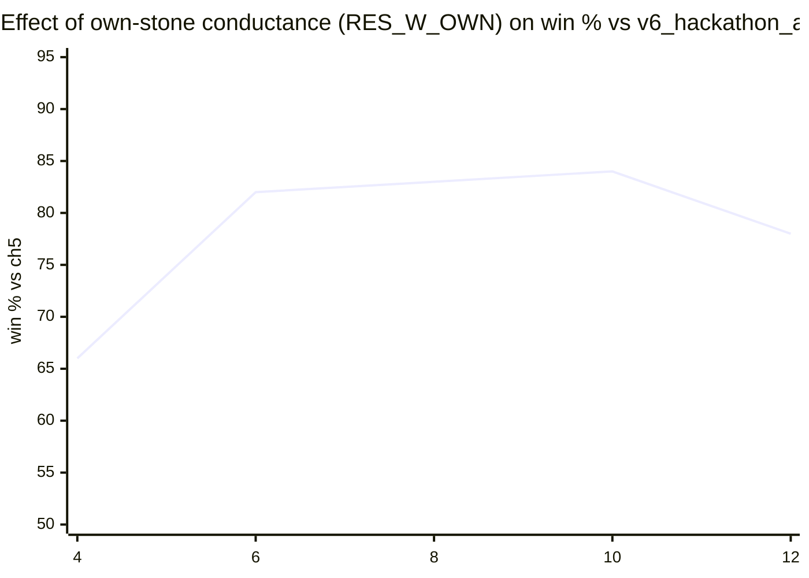
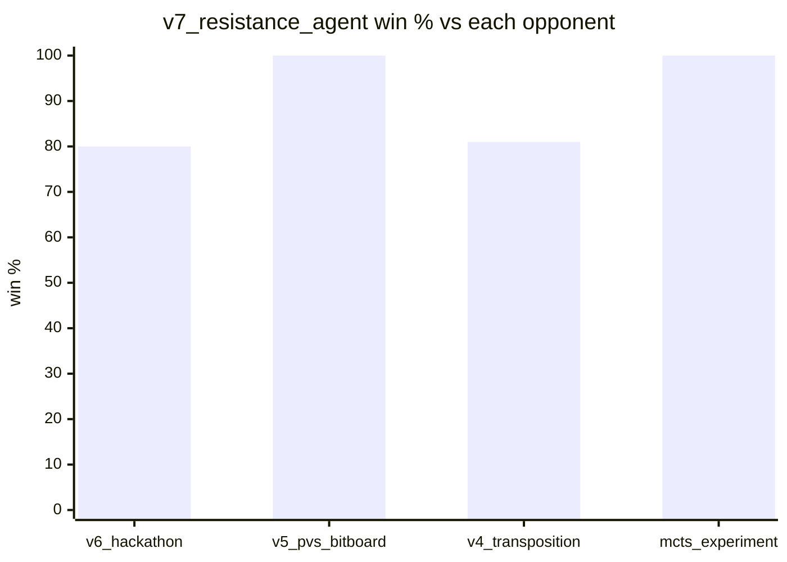

# `v7_resistance_agent.py` — Deep Dive

A complete walkthrough of how the champion Hex agent works: its architecture, the
electrical‑resistance evaluation at its heart (with the math), the alpha‑beta search
around it, the tactical safety layers, and why it beats the shortest‑path agent it was
built from.

> **One‑line summary.** It is an iterative‑deepening **principal‑variation‑search
> (PVS) alpha‑beta** engine whose *leaf evaluation* models the board as an
> **electrical resistor network** and scores a position by the ratio of the two
> players' edge‑to‑edge resistances, `log(R_opponent / R_me)`.

---

## Table of contents

1. [Architecture at a glance](#1-architecture-at-a-glance)
2. [Board representation](#2-board-representation)
3. [Hex adjacency (the 6 neighbours)](#3-hex-adjacency-the-6-neighbours)
4. [Win detection: bitboard flood fill](#4-win-detection-bitboard-flood-fill)
5. [The evaluation: electrical resistance](#5-the-evaluation-electrical-resistance)
6. [The search: iterative‑deepening PVS alpha‑beta](#6-the-search-iterative-deepening-pvs-alpha-beta)
7. [Move ordering](#7-move-ordering)
8. [Tactical safety layers](#8-tactical-safety-layers)
9. [Parameters and tuning](#9-parameters-and-tuning)
10. [Complexity and performance](#10-complexity-and-performance)
11. [Limitations](#11-limitations)
12. [Glossary and references](#12-glossary-and-references)

---

## 1. Architecture at a glance

Every call to `get_move(state)` runs this pipeline. The cheap, *always‑correct*
tactical checks run first; the expensive search only runs if nothing decisive was
found and there is time left.



**Key idea:** the *only* thing that fundamentally changed from the hackathon agent
(`v6_hackathon_agent.py`) is box **I**'s leaf evaluation — everything else is the same
proven scaffolding.

---

## 2. Board representation

Three synchronized views of the same 11×11 board are kept for speed:

| View | Type | Used for |
|---|---|---|
| **1‑D list** `board[121]` | `list[int]` (`-1` empty, `0`/`1` stones) | move generation, evaluation input |
| **Bitboards** `(p0_bits, p1_bits)` | two Python ints (121 bits each) | O(1)‑ish win detection |
| **Zobrist hash** | one 64‑bit int | transposition‑table key |

The 2‑D `[row][col]` board from the engine is flattened with `idx = row * n + col`:

```
 (r,c)  ->  idx = r*11 + c

 col:      0    1    2   ...  10
 row 0:    0    1    2   ...  10
 row 1:   11   12   13   ...  21
 row 2:   22   23   24   ...  32
   ...
 row 10: 110  111  112   ...  120
```

A move at cell `idx` sets a bit in the mover's bitboard; the Zobrist hash is updated
incrementally (see [§6.3](#63-transposition-table-zobrist-hashing)). Working on flat
integers and bitmasks instead of nested lists is what makes the inner search loop
cheap.

---

## 3. Hex adjacency (the 6 neighbours)

Hex is played on a rhombus, so each interior cell has **6** neighbours, not 4 or 8.
Stored as `[row][col]`, the six offsets are:

```python
NEIGHBOR_DIRS = [(-1, 0), (-1, 1), (0, -1), (0, 1), (1, -1), (1, 0)]
```

The two "diagonal" neighbours are **(−1, +1)** and **(+1, −1)** — the *anti‑diagonal*.
The other diagonal `(−1,−1)/(+1,+1)` is **not** connected. Picture the rhombus as a
sheared grid:

```
        (r-1,c) (r-1,c+1)
             \   /
      (r,c-1)—(r,c)—(r,c+1)
             /   \
       (r+1,c-1) (r+1,c)
```

Getting this wrong (using the other diagonal, or letting a flat‑index neighbour
"wrap" across a row boundary) is the classic Hex bug; the win detector in
[§4](#4-win-detection-bitboard-flood-fill) is carefully masked to avoid it.

---

## 4. Win detection: bitboard flood fill

A player has won when a chain of their stones connects their two edges
(**Player 0: left↔right; Player 1: top↔bottom**). This is checked by a
**parallel flood fill on bitboards** — no per‑cell BFS.

Seed the frontier with the player's stones on their *source* edge, then repeatedly
expand along all 6 hex directions (as bit shifts) intersected with the player's
stones, until either the *target* edge is reached or nothing new is added:

```python
frontier = seen                                  # stones on the source edge
while frontier:
    expanded  = frontier >> n                                   # (r-1, c)
    expanded |= (frontier << n) & all_bits                      # (r+1, c)
    expanded |= (frontier & not_right_edge) << 1                # (r,   c+1)
    expanded |= (frontier & not_left_edge)  >> 1                # (r,   c-1)
    expanded |= (frontier & not_right_edge) >> (n - 1)          # (r-1, c+1)
    expanded |= ((frontier & not_left_edge) << (n - 1)) & all_bits  # (r+1, c-1)
    new = expanded & player_bits & ~seen         # only own, unvisited cells
    if not new: break
    seen |= new
    if seen & target_edge_mask: return True
    frontier = new
```

**Why the masks matter.** A shift like `<< 1` moves every set bit to `idx+1`. For a
cell on the **right** edge, `idx+1` would spill into the *next row's left* cell — a
false connection. Masking with `not_right_edge` (and `not_left_edge` for the opposite
shifts) removes those bits *before* shifting, so the fill never wraps around the
board. `& all_bits` keeps left shifts inside 121 bits.

This runs at most ~11 iterations (the board diameter) and each iteration is a handful
of big‑integer ops — far cheaper than a Python‑level BFS, and it's called constantly
during search.

---

## 5. The evaluation: electrical resistance

This is the heart of the agent and the reason it out‑plays the shortest‑path version.

### 5.1 The intuition

Think of one player trying to push **electric current** from one of their edges to the
other:

- **Your own stones** are near‑perfect wires (low resistance) — current flows freely.
- **Empty cells** are ordinary resistors — usable but costly.
- **The opponent's stones** are insulators (infinite resistance) — no current passes.

If it's *easy* to push current from your left edge to your right edge, you are well
connected. The total resistance of the network captures this — and crucially it
accounts for **every** path and how they overlap, not just the single shortest one.
Two independent routes to victory give lower resistance than one, which is exactly the
Hex concept a shortest‑path score is blind to.



*Higher conductance (thicker wire) = better connected. Opponent cells are simply
absent from the graph.*

### 5.2 The math

Model the board as a graph over the 121 cells. For the player being scored, give each
cell `i` a **weight**

$$
W_i = \begin{cases} w_{\text{own}} = 8 & \text{if } i \text{ is my stone}\\ 1 & \text{if } i \text{ is empty}\\ 0 & \text{if } i \text{ is the opponent's stone (blocks)} \end{cases}
$$

The **conductance** of the edge between adjacent cells `i, j` is the product

$$
g_{ij} = W_i \cdot W_j .
$$

So own–own edges conduct at $8\times8=64$, own–empty at $8$, empty–empty at $1$, and
anything touching an opponent stone at $0$ (removed). This product form makes chains of
your own stones behave like thick wire while empty gaps stay resistive.

**Terminals.** The player's two edges become a **+1 V source rail** and a **0 V ground
rail**. Each source‑edge cell connects to the source rail with conductance $s_i = W_i$;
each target‑edge cell connects to ground with $t_i = W_i$ ($s_i, t_i = 0$ elsewhere).

**Kirchhoff's current law** at each node `i` (potential $v_i$) says the net current is
zero:

$$
\sum_{j \sim i} g_{ij}\,(v_i - v_j) \;+\; s_i\,(v_i - 1) \;+\; t_i\,(v_i - 0) \;=\; 0 .
$$

Rearranging over all nodes gives a linear system

$$
A\,\mathbf{v} = \mathbf{s}, \qquad
A = L + \mathrm{diag}(\mathbf{s} + \mathbf{t}) + \varepsilon I,
$$

where $L$ is the **weighted graph Laplacian** ($L_{ii} = \sum_j g_{ij}$,
$L_{ij} = -g_{ij}$). The $\mathrm{diag}(\mathbf{s}+\mathbf{t})$ term grounds the
terminals and the tiny $\varepsilon I$ ($\varepsilon = 10^{-6}$) keeps $A$ strictly
positive‑definite (and invertible even when isolated empty cells would otherwise make
$L$ singular).

Solve for the node potentials $\mathbf{v}$. The **effective conductance** is the total
current leaving the source rail (which sits at 1 V):

$$
C_{\text{eff}} = \sum_{i \in \text{source}} s_i\,(1 - v_i) = \mathbf{s} \cdot (\mathbf{1} - \mathbf{v}),
\qquad R = \frac{1}{C_{\text{eff}}} .
$$

Compute $R$ once for **me** and once for the **opponent** (a separate network with the
weights and edges recomputed from that player's perspective). The position score, from
the root player's point of view, is

$$
\text{score} = k \cdot \big(\ln R_{\text{opp}} - \ln R_{\text{me}}\big) = k \cdot \ln\frac{R_{\text{opp}}}{R_{\text{me}}}, \qquad k = 1000
$$

with `k` = `RES_SCALE` = 1000. It is **positive when my resistance is lower than the
opponent's** (I am better connected), symmetric around 0, and additive — the log makes
"twice as connected" worth the same swing regardless of the absolute scale.

### 5.3 The construction in code

```python
W = np.where(barr == player, w_own, np.where(barr == EMPTY, 1.0, 0.0))
g = W[I] * W[J]                       # edge conductances (I,J = precomputed edge list)
A = np.zeros((121, 121))
A[I, J] = -g;  A[J, I] = -g           # off-diagonal  = -g_ij
deg = bincount(I, g) + bincount(J, g) # sum of incident conductances per node
A[diag] = deg + s + t + eps           # diagonal = L_ii + s_i + t_i + eps
v = np.linalg.solve(A, s)             # fall back to lstsq on singular A
C = s @ (1 - v);  R = 1 / C
```

The edge list `(I, J)` and the rail masks are precomputed once per board size in
`_ensure_board_tools`, so per‑evaluation work is just building `A` and one dense solve.

### 5.4 Bridge / virtual‑connection augmentation

A **bridge** is two of your stones a knight's‑move apart that share exactly two empty
"carrier" cells — a *guaranteed* connection, because if the opponent takes one carrier
you take the other. Plain adjacency conductance doesn't see this (the two stones aren't
neighbours). So before solving, for every own‑stone bridge whose **both carriers are
still non‑opponent**, an extra strong link of conductance `RES_BRIDGE_COND = 64` (=
$w_{\text{own}}^2$, i.e. as good as a solid own–own connection) is added between the two
endpoints:

```python
valid = own[src] & own[end] & (carrier_a != opp) & (carrier_b != opp)
A[si, ei] -= gb ;  A[ei, si] -= gb ;  A[si, si] += gb ;  A[ei, ei] += gb
```

This is the "VC augmentation" that lifts the resistance model from a raw
shortest‑path‑like measure toward the connection‑aware evaluation used by the strongest
classical Hex engines. Setting the bridge conductance *higher* than a solid link
(experimentally) hurts — a bridge should be worth *at most* a real connection.

### 5.5 Why resistance beats shortest path

Consider two candidate positions with the *same* shortest connecting distance, but one
has a **single** thin route and the other has **two disjoint** routes:

```
 shortest-path score:   both look equal (same min distance)
 resistance score:      two parallel routes  ->  lower resistance  ->  preferred
```

The two‑route position is far safer (the opponent can't cut both), and only the
resistance score prefers it. Steering toward multi‑path, hard‑to‑cut structures is
precisely how `v7_resistance_agent` out‑positions the shortest‑path `v6_hackathon_agent`.

### 5.6 Performance: the single‑thread BLAS trick

A 121×121 dense solve is tiny, but on this machine multithreaded OpenBLAS spent **~9 ms
per solve** in thread‑dispatch overhead — which would make evaluating every leaf
hopeless. Forcing BLAS to a single thread **before** importing numpy drops it to
**~0.1 ms**:

```python
os.environ["OPENBLAS_NUM_THREADS"] = "1"   # (and OMP/MKL/NUMEXPR) — must precede
import numpy as np                          #  the numpy import
```

| BLAS threads | 121×121 solve | evals/sec (2 solves) |
|---|---|---|
| multithreaded (default) | ~9 ms | ~55 |
| **single (this agent)** | **~0.1 ms** | **~2500** |

That ~45× headroom is what makes a resistance‑at‑every‑leaf search feasible in 5 s.

---

## 6. The search: iterative‑deepening PVS alpha‑beta

### 6.1 Iterative deepening and time management

The agent searches depth 1, then 2, then 3, … keeping the best move from the deepest
**completed** iteration, and stops when time runs low. This gives an "anytime" search
that always has a legal, reasonable move ready.

Two deadlines are used:

- **Soft** (`4.05 s`): normal stop.
- **Hard** (`4.40 s`): a safety buffer.

**Dynamic extension:** if, at depth ≥ 3, a deeper iteration *changes the best move* or
the score *swings by > 260*, the position is tactically unstable, so the deadline is
pushed from soft to hard to resolve it instead of returning a shaky move. All limits sit
comfortably under the platform's 5 s cap (≈4.4 s observed max) so a slow machine can't
cause a timeout loss.



### 6.2 Alpha‑beta with PVS (null‑window) pruning

Standard minimax with alpha‑beta cutoffs, upgraded to **principal‑variation search**:
the first (best‑ordered) child is searched with the full window `[α, β]`; every later
child is first probed with a **null window** `[α, α+ε]` (cheap — just proves "not
better"), and only **re‑searched** with the full window if that probe lands inside
`(α, β)`.

```text
function alphabeta(node, depth, α, β, root_player):
    probe transposition table; use stored bound/value if deep enough
    if node is a win for root_player:  return +1e6 + depth
    if node is a loss:                 return -1e6 - depth
    if depth == 0:                     return evaluate(node)      # ← resistance eval

    moves = ordered_candidates(node)          # TT move, killers, then heuristic order
    first = true
    for m in moves:
        if first:
            score = -alphabeta(child, depth-1, α, β, ...)          # full window
        else:
            score = -alphabeta(child, depth-1, α, α+ε, ...)        # null window
            if α < score < β:
                score = -alphabeta(child, depth-1, α, β, ...)      # re-search
        first = false
        update best / α ; if α ≥ β: record killer; break           # cutoff
    store (depth, value, flag ∈ {EXACT, LOWER, UPPER}, best_move) in TT
    return value
```

Win/loss are scored `±(1,000,000 + depth)` so the search prefers **faster** wins and
**slower** losses. Time is polled every `CHECK_INTERVAL` nodes and raises
`SearchTimeout`, caught at the root so the best move so far is always returned.

### 6.3 Transposition table (Zobrist hashing)

The same position is often reached by different move orders. Each position gets a
64‑bit **Zobrist hash**: a fixed random key per `(player, cell)` is XOR‑ed in when a
stone is placed, so the hash updates **incrementally** in O(1):

$$
h' = h \;\oplus\; Z[\text{player}][\text{cell}].
$$

The table stores, per position, `(depth, score, flag, best_move)` where `flag` marks the
score as an **exact** value, a **lower** bound (a cutoff), or an **upper** bound. On
re‑visiting a position at ≤ the stored depth, the entry gives an immediate value or
tightens `[α, β]`; even when it can't cut, its `best_move` is tried first (the single
most valuable move‑ordering hint). The table (and per‑move caches) are cleared at the
start of each `get_move` for safety.

---

## 7. Move ordering

Good ordering is what makes alpha‑beta/PVS actually prune. Candidates at each node are
ranked, cheaply, by:

1. **Transposition‑table best move** (from a previous iteration) — tried first.
2. **Killer moves** — quiet moves that caused a cutoff at the same depth elsewhere.
3. **Heuristic score** — a fast static score combining: neighbours of your stones,
   centre proximity, **bridge creation**, **opponent‑bridge attacks**, edge
   orientation, and whether the cell lies on (or next to) the current **shortest
   connection path** for either player.

Candidate cells themselves are generated from the shortest‑path cells (and their
neighbours) for both players plus a few top static‑scoring cells, then capped
(`NODE_CANDIDATE_LIMIT = 11` interior, `ROOT_CANDIDATE_LIMIT = 22` at the root). The
shortest paths come from a **Dijkstra** pass (own stone = cost 0, empty = 1, opponent =
∞, with a small 0.45 shortcut across already‑formed bridges), cached per position by
Zobrist hash.

---

## 8. Tactical safety layers

The resistance evaluation is strong positionally but, like all heuristics, can
misjudge a sharp tactic. So decisive checks run **outside** and **before** the fuzzy
search, and are never pruned:

| Layer | What it does |
|---|---|
| **Opening book** | Player 0 opens in the centre; Player 1 answers a centre opening from a strong ring of replies. |
| **Immediate win** | Scan every legal cell; if one completes my connection, play it at once. |
| **Immediate block** | If the opponent has a one‑move win, play that cell to deny it. |
| **Two‑ply fork guard** | At the root, penalise any move that lets the opponent reach a position with **two** immediate winning threats (an unstoppable fork) or a forced win on the reply. |
| **Save‑bridge reply** | If the opponent just intruded into one carrier of a bridge and the other carrier is empty, boost that carrier so the search restores the connection. |

Together these guarantee the agent never overlooks a one‑move win, never allows a
one‑move loss it could stop, and won't walk into a two‑move fork — the failure modes a
purely evaluative player is prone to.

---

## 9. Parameters and tuning

All tuned by self‑play against `v6_hackathon_agent.py` in `arena.py`:

| Constant | Value | Meaning |
|---|---|---|
| `RES_W_OWN` | **8.0** | conductance weight of an own stone (empty = 1). The dominant lever. |
| `RES_BRIDGE_COND` | **64.0** | extra conductance for a secured bridge (= `RES_W_OWN²`). |
| `RES_SCALE` | 1000 | scales `log(R_opp/R_me)` into the search's score units. |
| `RES_EPS` | 1e‑6 | Laplacian regularisation (keeps `A` invertible). |
| `ROOT_CANDIDATE_LIMIT` | 22 | root branching cap. |
| `NODE_CANDIDATE_LIMIT` | 11 | interior branching cap. |
| `MAX_SEARCH_DEPTH` | 8 | ceiling; ~5 ply is typically reached in 4 s. |
| `SOFT / HARD_TIME` | 4.05 / 4.40 s | move deadlines (safely < 5 s). |

**The key finding:** how strongly your own stones conduct (`RES_W_OWN`) matters far
more than anything else. Raising it from the initial 4 to 8 (with the bridge
conductance scaled to `W_own²`) is what took the win rate against the hackathon agent
from roughly 65 % to ~80 %. Too high (≥ 12) starts to hurt, and a bridge stronger than a
solid link hurts too.



*(Trend across the sweep; individual points carry ±8 % noise at 40–100 games — see
[§10](#10-complexity-and-performance).)*

History‑heuristic ordering and a resistance + shortest‑path **hybrid** eval were both
tried and **dropped** — neither beat the plain tuned resistance agent.

---

## 10. Complexity and performance

- **Leaf evaluation:** two Laplacian solves ≈ **0.2–0.5 ms** (single‑thread BLAS).
  This is the dominant cost and is why the search is deliberately narrow.
- **Depth reached:** ~4–5 ply in the 4 s budget (~10–12 k nodes), heavily pruned by
  PVS + the transposition table + good ordering.
- **Win detection:** ~11 bit‑parallel iterations, negligible.
- **Move time:** ≈ 4.4 s maximum observed, safely under the 5 s limit.

**Measured strength** (from `arena.py`, colour‑balanced, full time):



Against the hackathon agent the result is **80 % over 100 games, symmetric across
colours (P0 80 %, P1 80 %)**, and it wins the natural no‑opening game as both colours.
Because both agents use wall‑clock iterative deepening, small batches swing (63–92 %);
100 games gives the reliable ±8 % estimate.

---

## 11. Limitations

- **No‑swap Hex has a first‑player winning strategy**, so no agent can be 100 % across
  colours — some random test openings are simply lost for whoever moves second. ~80 %
  *balanced* is near the practical ceiling for a hand‑crafted agent.
- **The resistance model is heuristic**, not a proof of connection. It can slightly
  over‑value dense/clustered shapes; the tactical layers in [§8](#8-tactical-safety-layers)
  exist to cover the sharp cases it might misjudge.
- **Timing sensitivity:** move quality depends a little on how deep the wall‑clock
  budget allows the search to go, so results have run‑to‑run variance against a
  closely‑matched opponent.
- **Next step (not implemented):** full virtual‑connection *H‑search* with **must‑play**
  pruning would search deeper and detect wins earlier — the largest known lever for
  classical Hex — but it is complex and its gains are hard to validate against the ±8 %
  noise floor.

---

## 12. Glossary and references

**Glossary**

- **Bridge / virtual connection (VC):** a pattern that is connected *even if the
  opponent moves first* (e.g. two stones sharing two empty carriers).
- **Effective resistance:** the resistance of the whole network between two terminals;
  low = well connected via many/short paths.
- **Graph Laplacian:** the matrix `L = D − G` (degree minus adjacency, weighted by
  conductance) whose grounded form we solve.
- **PVS (principal‑variation search):** alpha‑beta that probes non‑first moves with a
  null window and re‑searches only when needed.
- **Zobrist hashing:** incremental XOR hashing of a board position for the
  transposition table.
- **Must‑play region:** the set of cells that don't immediately lose — the key pruning
  idea in top classical engines (future work here).

**References** (the ideas this agent builds on)

- V. Anshelevich, *A hierarchical approach to computer Hex* — the resistance evaluation
  and virtual connections (the "Hexy" engine).
- U. Alberta *Wolve* / *MoHex* (benzene) — resistance + VC evaluation in an alpha‑beta
  player, and the must‑play / inferior‑cell machinery.
- Shannon & Moore (1953) — the original electrical‑network model of a connection game.

*See [`README.md`](README.md) for the full agent lineage and how to run everything.*
